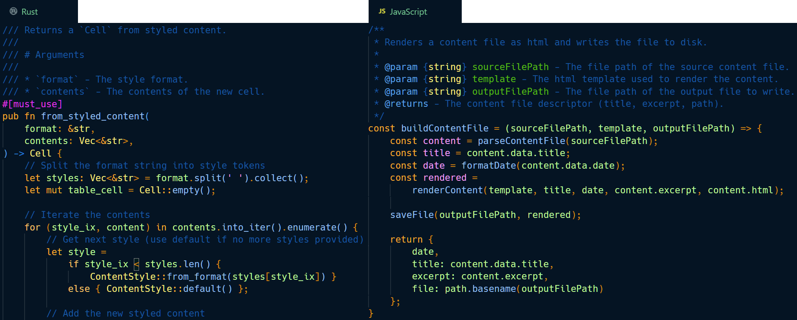
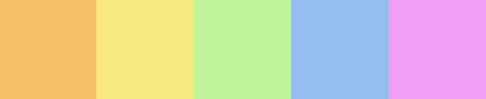
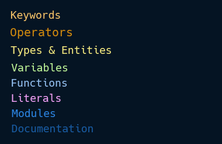
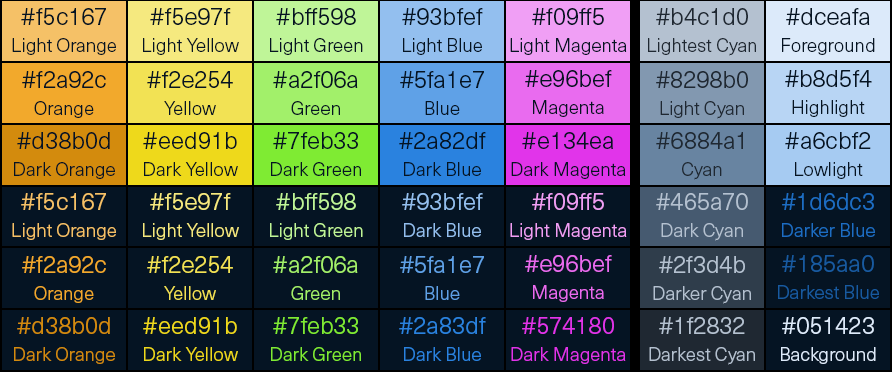
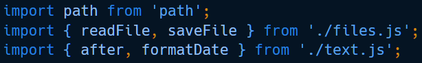

# Statn Penta

A theme for the discerning developer using complementary colors to distinguish key elements. Penta aims to leverage contrast for distinctive clarity while being soft enough for everyday use.

## In Action

Rust and JavaScript in action, using Penta:

## Colors

Penta is built around five tones, each associated with different token groups.

## Tokens

The following broad categories describe how particular tokens are grouped and
colored.

* Keywords (Orange)
* Operators (Dark Orange)
* Types, Entities (Yellow)
* Variables (Green)
* Functions (Blue)
* Literals (Purple)
* Special (Attributes, Preprocessor) (Purple)
* Modules (Blue)
* Comments/Doc (Dark Blue)
* Punctuation (White)

## Tints & Shades

Tints and shades are used to provide further distinction between elements.

For example, JavaScript module imports use three tones of blue to distinguish keywords, package names, and package contents.

## Color Codes

The following is a list of color codes in text format.

**Oranges**
  * 
#f5c167 (Light Orange)
 
  * 
#f2a92c (Orange)

  * 
#d38b0d (Dark Orange)

**Yellows**
  * 
#f5e97f (Light Yellow)

  * 
#f2e254 (Yellow)

  * 
#eed91b (Dark Yellow)

**Greens**
  * 
#bff598 (Light Green)

  * 
#a2f06a (Green)

  * 
#7feb33 (Dark Green)

  * 
#58ba12 (Darker Green)

**Blues**
  * 
#dceafa (Lightest Blue)

  * 
#93bfef (Light Blue)

  * 
#5fa1e7 (Blue)

  * 
#2a82df (Dark Blue)

  * 
#185aa0 (Darker Blue)

  * 
#051423 (Darkest Blue)

**Purples**
  * 
#f09ff5 (Light Purple)

  * 
#e96bef (Purple)

  * 
#e134ea (Dark Purple)

**Cyans**
*(used as editor highlights and for passive/disabled states)*
  * 
#b4c1d0 (Lightest Cyan)

  * 
#8298b0 (Light Cyan)

  * 
#6884a1 (Cyan)

  * 
#465a70 (Dark Cyan)

  * 
#2f3d4b (Darker Cyan)

  * 
#1f2832 (Darkest Cyan)

## License

See the  file for details.